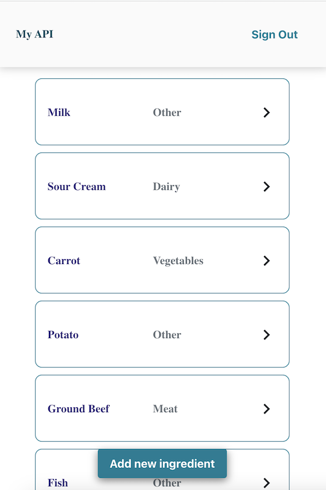

# Welcome to My Fully Managed Api

Main link: https://master.d1e77a5mh3gbbs.amplifyapp.com/

## Task

- Find a topic you like (volcanoes/earthquakes/animals/...), get a lot (more than 1k row data)
- Build an API using Amplify
- Features of the project: User authentification, Session must be stored in Redis (for multiple instances purposes), User Token (OAuth), Get/Post/Update/Destroy on the topic
- Your project must be hosted in the cloud

## Description

I desided to manage ingredients list, because I need this type of data for my another pet project Meals Planner.
For my purposes I used:

- Figma: to build UI components
- JavaScript and React code
- Amplify Studio UI Library: to syncronize some of Figma components into JavaScript/React code
- Amplify Studio Authentication: to set up sign up, sign in and storing sessions
- Amplify Studio Data: to create Data model for a project
- Graph QL: to fetch data from a server
- Amplify Cloud: to host my application

## Installation

#### To run locally

`npm start`

#### Syncronize with amplify

`amplify pull`  
`amplify push`

## Preview screenshots

### Main screen

<!--  -->

### Create item screen

The Core Team
Made at Qwasar Silicon Valley
